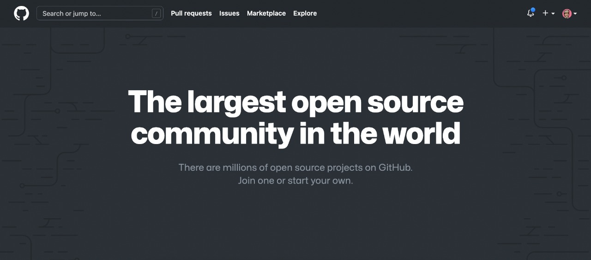

import { Head, Image, Appear } from "mdx-deck";
import Code from "mdx-code";
import { CodeSurfer } from "mdx-deck-code-surfer";

export { default as theme } from "./theme";

import { Intro } from "./Intro";
import { Cover } from "./Cover";
import { PopularOpenSourceProjects } from "./PopularOpenSourceProjects";
import { PopularOpenSourceApps } from "./PopularOpenSourceApps";
import { Sponsor } from "./Sponsor";
import { Thanks } from "./Thanks";

import { Img } from "./Img";

<Head>
  <title>Open Source</title>
</Head>

<Cover />

---

<Intro />

---

## Overview

<ul>
  <Appear>
    <li>What is open source</li>
    <li>How to contribute to open source</li>
    <li>Why to contribute to open source</li>
    <li>Why your company should do open source</li>
  </Appear>
</ul>

---

## What is open source

Open source is all the source/content that is available for everyone in the world, and not in private to a specific group.

---

## Open Source on Github

---

<PopularOpenSourceProjects />

---

<PopularOpenSourceApps />

---

## How to contribute to open source

<ul>
  <Appear>
    <li>Code (Github)</li>
    <li>Blogposts/Articles (Dev.to, Substack, Medium)</li>
    <li>Communities (Twitter, Discord, Slack)</li>
    <li>Videos/Audio (Youtube, Twitch, Podcasts)</li>
  </Appear>
</ul>

---

## Why to contribute to open source

<ul>
  <Appear>
    <li>Learn things outside your job</li>
    <li>Help other developer</li>
    <li>Get job opportunities</li>
    <li>Have fun</li>
  </Appear>
</ul>

---

## Why your company should do open source

<ul>
  <Appear>
    <li>Get visibility</li>
    <li>Get help from developers around the world</li>
    <li>Find talents</li>
  </Appear>
</ul>

---

## Why don't you contribute to open source?

---

## Why the source code of your company is not public?

---

<Sponsor />

---

<Thanks />
